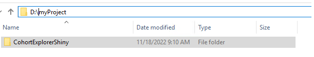
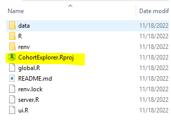
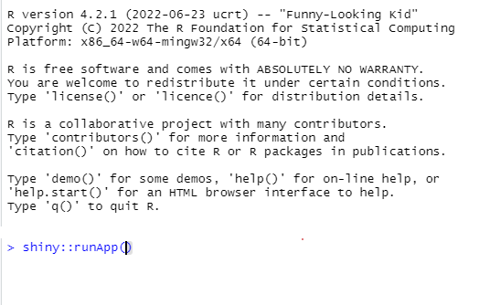

```{r, echo = FALSE, message = FALSE}
library(SqlRender)
knitr::opts_chunk$set(
  cache = FALSE,
  comment = "#>",
  error = FALSE,
  tidy = FALSE
)
```

# Introduction

CohortExplorer is a R package that outputs a Shiny viewer embedded with person level data. This shiny app when run, shows the profiels of persons in the cohort.

## Assumptions:
- You have instantiated a valid cohort in a cohort table.
- You have access to person level data in the OMOP CDM V5.x + format on a database.
- You only need read access to the person level data. But you should have privileges to join the cohort table in the cohortDatabaseSchema with the person level data in the cdmDatabaseSchema.
- You have installed R and R-studio as described in the [Book of OHDSI](https://ohdsi.github.io/TheBookOfOhdsi/SqlAndR.html)

cohortDatabaseSchema: Schema name where your cohort tables reside.
cdmDatabaseSchema: Schema name where your omop cdm tables with person level data reside.


# Creating the shiny application

CohortExplorer has one function createCohortExplorerApp that when properly configured will connect to your database, check if the cohort table is instantiated, identify (random) sample of persons, extract their person level data, compile the output into an executable shiny application that may be executed.

Example: in the configuration example shown below, your output folder is "D:/myProject". The output will be created in that location.

```
connectionDetails <-
  DatabaseConnector::createConnectionDetails(
    dbms = "postgresql",
    server = "some.server.com/ohdsi",
    user = "joe",
    password = "secret"
  )

createCohortExplorerApp <- function(connectionDetails = connectionDetails,
                                    cohortDatabaseSchema = "cohort",
                                    cdmDatabaseSchema = "cdm",
                                    vocabularyDatabaseSchema = "cdm",
                                    cohortTable = "myCohortTable",
                                    cohortDefinitionId,
                                    cohortName = "personsWithSomeDisease",
                                    sampleSize = 25,
                                    exportFolder = "D:/myProject",
                                    databaseId,
                                    shiftDates = FALSE,
                                    assignNewId = FALSE)
```

In the exportFolder location there will be a 




Inside that folder is the 

.

## How to run app locally
Please ensure all R and R-studio sessions are closed on your computer. Then, double click the file CohortExplorer.Rproj. This will start RStudio. We recommend that you now run renv::restore() as it will set up all R package dependencies and if executed properly will ensure your app will run smoothly. You can then start the shiny app by typing in R studio console



## How to run app on a R Studio server
Please zip the CohortExplorerShiny folder into one zip file and upload to the folder on the remote R studio server. The name of the folder in the remote R studio server should become the published Shiny App name (url)
